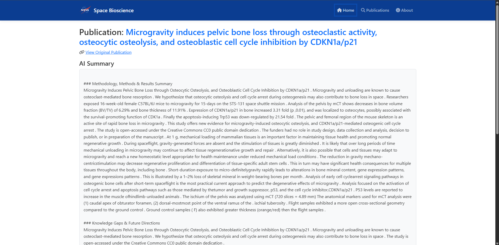

# NASA Bioscience Publications Explorer

## The Challenge
Enable a new era of human space exploration! NASA has been performing biology experiments in space for decades, generating a tremendous amount of information that will need to be considered as humans prepare to revisit the Moon and explore Mars. Although this knowledge is publicly available, it can be difficult for potential users to find information that pertains to their specific interests. Your challenge is to build a dynamic dashboard that leverages artificial intelligence (AI), knowledge graphs, and/or other tools to summarize a set of NASA bioscience publications and enables users to explore the impacts and results of the experiments these publications describe.

## Our Solution
NASA Bioscience Publications Explorer is a Flask-based web dashboard for searching, exploring, and summarizing NASA space biology research publications. It features smart search, AI-powered summaries, PDF upload and analysis, and a modern, responsive user interface. The backend handles publication data, PDF/text processing, and AI summarization using NLP models. The frontend provides intuitive navigation, publication details, and team information. The project is organized for easy extension and deployment, supporting both local and cloud environments.

## Features
- **Search Publications:** Find research by title, keywords, or topics.
- **AI Summaries:** Get concise summaries and previews of research papers.
- **PDF Upload:** Upload your own PDF to generate a summary and preview.
- **Publication Details:** View metadata and links to original publications.
- **About Page:** Meet the Lumiverse team with bios and social links.
- **Responsive Design:** Works well on desktop and mobile.

## Project UI
### Home/Search Page

*The landing page provides a search bar for quick access to NASA bioscience publications and highlights key features of the dashboard.*

### Search Results

*Displays a list of publications matching your search query, with metadata and quick links to details and downloads.*

### PDF Upload & AI Summary

*Upload your downloaded publication's PDF to receive an instant AI-generated summary and preview of the document's main findings.*


*Shows the AI-powered summary of the uploaded or selected publication, making complex research easy to understand.*


*View extracted text and metadata from the publication, including experiment details and links to the original source.*

### About/Team Page

*We are team Lumiverse and this is our team information.*


## Project Structure
```
├── app.py                  # Main Flask application
├── config.py               # Configuration settings
├── requirements.txt        # Python dependencies
├── api/                    # API endpoints
├── data/                   # Publication CSV, PDF files, cache
│   ├── SB_publication_PMC.csv
│   ├── pdfs/
│   ├── cache/
│   └── uploads/
├── downloads/              # Downloaded files
├── services/               # PDF/text processing, AI analyzer
│   ├── ai_analyzer.py
│   ├── pdf_processor.py
│   ├── search_service.py
│   └── uploadpdf.py
├── static/                 # CSS, JS, images
│   ├── assets/
│   ├── css/
│   └── js/
├── templates/              # HTML templates
│   ├── base.html
│   ├── index.html
│   ├── publication.html
│   ├── search_results.html
│   └── about.html
```

## Data Source
All publication data is sourced from the [NASA Space Biology Publications Dataset](https://github.com/jgalazka/SB_publications/tree/main).

## Getting Started

### Prerequisites
- Python 3.10+
- pip

### Installation
1. Clone the repository:
   ```bash
   git clone https://github.com/LsLisan/NASA_Bioscience_Dashboard.git
   cd NASA_Bioscience_Dashboard
   ```
2. Install dependencies:
   ```bash
   pip install -r requirements.txt
   ```
3. Run the app:
   ```bash
   python app.py
   ```
4. Open your browser at [http://127.0.0.1:5000](http://127.0.0.1:5000)

### PDF Summarization
- Upload a PDF on the publication detail page to generate an AI summary and preview.

## Folder Details
- `data/` contains the main CSV and uploaded/downloaded PDFs.
- `services/` contains backend logic for PDF/text processing and AI analysis.
- `static/` holds all CSS, JS, and image assets.
- `templates/` contains all HTML pages.

## Team Details
Meet the Lumiverse Team:

| Name                   | Designation         | LinkedIn                                              | GitHub                   | Email                       |
|------------------------|---------------------|-------------------------------------------------------|--------------------------|-----------------------------|
| Adnan Rahman Sayeem    | Team Leader         | [LinkedIn](https://www.linkedin.com/in/adnan-rahman-sayeem/) | [GitHub](https://github.com/ar-sayeem)                        | sumaiya@example.com         |
| Sumaiya Amrin          | Developer           | [LinkedIn](https://www.linkedin.com/in/sumaiya-amrin-3b2157283/) | [GitHub](https://github.com/Amrin-Sumaiya) | sumaiyaamrin6@gmail.com      |
| MD. Lisan Islam        | Researcher          | [LinkedIn](https://www.linkedin.com/in/lslisan/)      | [GitHub](https://github.com/LsLisan)        | mdlisan36@gmail.com          |
| MD. TANVIRUL HOQUE     | Video Editor        | [LinkedIn](https://www.linkedin.com/in/nafis-bin-rahman/) | [GitHub](https://github.com/nafisbinrahman) | nafisbinrahman@gmail.com     |
| Md. Musfiqur Rahman    | Prototype Designer  | [LinkedIn](https://www.linkedin.com/in/md-musfiqur-rahman-1b2a2b2a2/) | [GitHub](https://github.com/zihadi009)      | musfiqur15-4641@diu.edu.bd   |

**All rights reserved to Lumiverse.**

